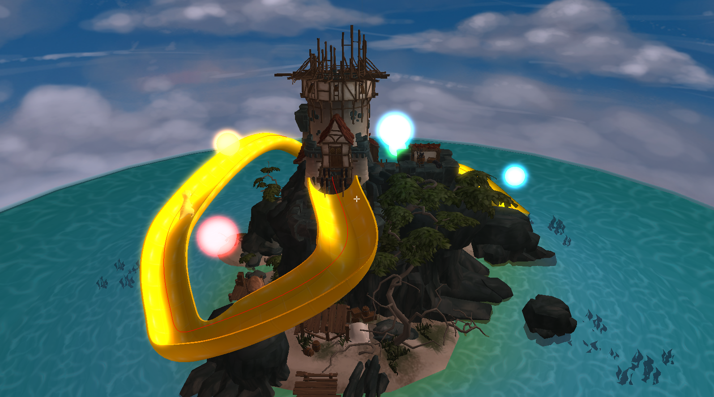
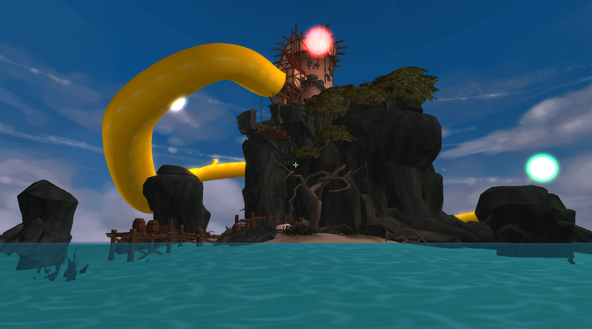
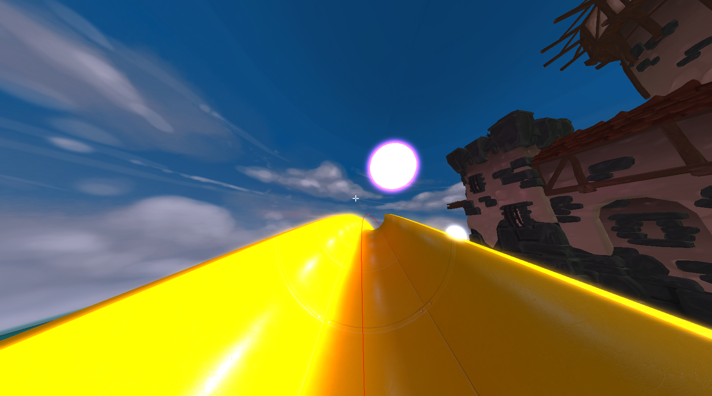
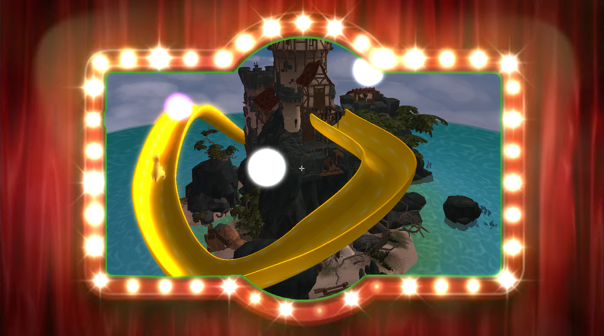

[](https://github.com/mathijs-follon/Computer-Graphics-Project/actions/workflows/clang-format.yml) [](https://github.com/mathijs-follon/Computer-Graphics-Project/actions/workflows/cmake-multi-platform.yml)


# Computer Graphics Project

A C++23 and OpenGL project built with CMake that showcases an interactive 3D scene and several real-time rendering techniques. The codebase is structured into small systems for windowing, camera control, rendering, lighting, post-processing, and scene objects, which makes the project easier to extend and experiment with.

**Demo:** [youtube video](https://www.youtube.com/watch?v=W0UpU7VaEPI)

## What this project demonstrates

* Real-time rendering with OpenGL
* A modular scene and system-based architecture
* Camera movement and scene interaction
* Lighting and bloom post-processing
* Chroma key rendering
* Asset loading and texture management
* Logging and diagnostics during development

## Screenshots

### Bird Eye



### Frog shot



### Dino perspective



### Chroma keying



## Repository structure

* `src/` contains the application code
* `assets/` contains runtime assets copied next to the executable
* `docs/images/` contains the screenshots used in this README
* `third_party/` contains external dependencies

## Build requirements

* CMake 3.30 or newer
* A C++23-compatible compiler
* OpenGL

The project uses GLFW, GLAD, spdlog, Assimp, and stb_image through the build system.

## Build and run

```bash
cmake -S . -B build
cmake --build build
./build/CG_OpenGL_Project
```

On Windows, run the executable from the build directory created by CMake. Or see the `.github/workflows` for a GitHub workflow building the application for windows.

## Notes

The repository is organized around a small engine-like pipeline, with separate setup, update, render, and shutdown stages. That keeps the graphics features isolated and makes it easier to add new objects, effects, or controls.


### Session Logging

Our session logs can be found here [@Tarudahat logs](/logging/taru.md), [@mathijs-follon logs](/logging/mathijs.md)

### Credits

- **Sea keep model**:
  This work is based on "Sea Keep "Lonely Watcher"" (https://sketchfab.com/3d-models/sea-keep-lonely-watcher-09a15a0c14cb4accaf060a92bc70413d) by Artjoms Horosilovs (https://sketchfab.com/Artjoms_Horosilovs) licensed under CC-BY-NC-SA-4.0 (http://creativecommons.org/licenses/by-nc-sa/4.0/)
- **Dinosaur model**:
  This work is based on "Dinosaur" (https://sketchfab.com/3d-models/dinosaur-c743536f3c8e48049a00f19c8f8f6d4a) by Q*Bert Reynolds (https://sketchfab.com/318arcade) licensed under CC-BY-4.0 (http://creativecommons.org/licenses/by/4.0/)
- **Utah Teapot** (for initial testing):
  If you use this 3D model in your project be sure to copy paste this credit wherever you share it:
This work is based on "The Utah Teapot" (https://sketchfab.com/3d-models/the-utah-teapot-1092c2832df14099807f66c8b792374d) by 3D graphics 101 (https://sketchfab.com/3dgraphics) licensed under CC-BY-NC-4.0 (http://creativecommons.org/licenses/by-nc/4.0/)


